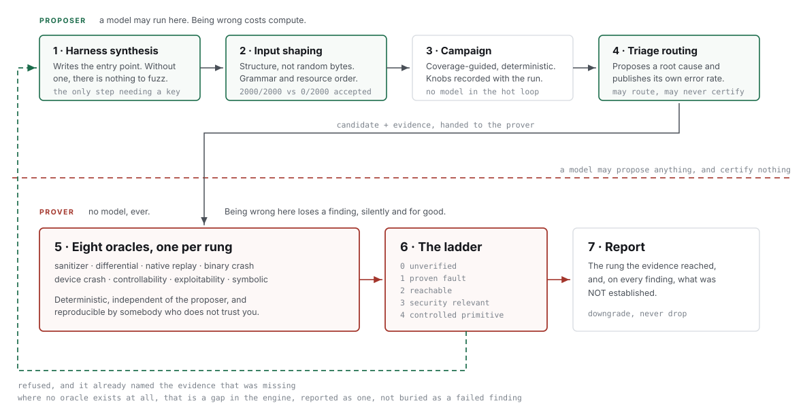

# Nemesis Forge

**An LLM fleet proposes. Deterministic oracles prove.**

Nemesis Forge is an autonomous vulnerability discovery engine with one rule wired
through its architecture: *a model may propose a candidate for any rung of the
exploitability ladder, and may certify none of them.* Certification comes from
oracles that are deterministic, independent of the proposer, and reproducible by
a third party.

That constraint is the whole design. It is also, on the evidence, the part the
field most needs.

---

## Why this exists

Discovery already scales. In the largest published effort to date, Claude Mythos
identified **23,019** vulnerability candidates; **126** were published as CVEs, and
**one** is attributed to the project itself. Of 1,061 publicly attributed AI-assisted
discoveries, **14 (1.3%)** were confirmed exploited in the wild, which is
[almost identical to the rate across all vulnerabilities](https://www.vulncheck.com/blog/anthropic-glasswing-cves).

Meanwhile maintainers are closing their doors. curl
[ended its bug bounty](https://daniel.haxx.se/blog/2026/01/26/the-end-of-the-curl-bug-bounty/)
in February 2026: roughly 20% of reports were AI-generated and only 5% of reported
vulnerabilities were real. libxml2 dropped embargoed reports entirely. Node.js
raised its signal floor.

AI raised the volume. It did not raise the value. The scarce thing is not a finding,
it is **a finding somebody can trust without redoing your work**, and that is what
this engine is built to produce.


---

## How this differs

| | Typical agent or scanner | Nemesis Forge |
|---|---|---|
| What sits at the centre | the **agent**; tools serve it | the **oracle**; the model serves it |
| Who decides a finding is real | the model, or a model ensemble | eight deterministic oracles, independent of the proposer |
| A finding it cannot prove | dropped, or reported anyway | **downgraded** to the rung the evidence reaches, never dropped |
| What it says it did *not* prove | usually nothing | printed on **every** finding, by default |
| Reproducing its output | needs the vendor, a key, or a service | clone and run, standard library, no key |
| Its own failure modes | not shipped | a **retracted finding** is in this repository, with the reason |
| Dependencies | a framework, a server, a database | none for the core |

The one that matters is the third row. A pipeline that drops what it cannot prove
looks precise and quietly loses real bugs. Of 1,061 publicly attributed AI-assisted
discoveries, only 1.3% were confirmed exploited, and a strict LLM judge measured
in this programme reached 1.00 precision at **0.27 recall**: never wrong about what
it accepted, and silently discarding nearly three quarters of the real findings.

---

## Architecture



A model proposes; it never certifies. The ladder is the only thing that decides what
a finding is worth, and when it refuses it says which evidence was missing. Where an
oracle does not exist at all, that is reported as a gap in the engine rather than
buried as a failed finding.

---

## Install

```bash
git clone https://github.com/eobi/nemesisforge.git
cd nemesisforge
python -m forge doctor
```

There is nothing to install. **The engine core is standard library only.** No server,
no database, no API key. `doctor` reports which optional lenses are present and what
their absence costs, so a null result is never mistaken for a completed search.

Optional lenses: a libFuzzer-capable clang (coverage-guided discovery), lldb or gdb
(rung-4 operand evidence), `angr` (symbolic reachability), `frida` (closed-binary
coverage).

---

## Scope and safety

Three things to be explicit about, because two of them decide whether a run is safe and the
third decides whether it runs at all.

**Harness synthesis requires a model provider.** `forge repo <url>` writes harnesses with an
LLM, and without a provider configured that agent no-ops cleanly rather than pretending.
Everything downstream of a harness — the campaign, all eight oracles, the ladder, triage and
the artifacts — is deterministic and runs with **no key**, which is what `forge lab` exercises
and what the sample run above shows. If you want harnesses without a model at all, generate
them with [Harness Forge](https://github.com/eobi/harness-forge) and feed them to `forge lab`.

**The Local and Windows execution backends are NOT isolation.** They are development
backends: a subprocess guarded by rlimits and a timeout, so the engine is testable on a
laptop without Docker. They contain nothing. `require_isolation()` refuses them for anything
that is not a controlled lab target, and that refusal is the mechanism — not a convention.

**Use the Docker sandbox for anything you did not write.** `DockerSandbox` is the production
backend: `--network none`, memory and pids caps, a real cgroup limit. Generated harnesses and
third-party targets belong there. Fuzz only code you are authorised to fuzz — this engine
compiles and executes what you point it at, and it will do that faithfully to a target you had
no right to touch.

---

## A sample run, start to finish

Nothing below is typed by hand. This is a clean clone, no API key, no
configuration.

```
$ python -m forge lab examples/harness_trunc.c --fuzz-time 30

[10:24:45] job=lab-2d9208e5 harness=examples/harness_trunc.c fuzz_time=30s provider=null
[10:24:49] 1 finding(s)

  rung 1   heap-buffer-overflow (WRITE)
  class      memory_safety
  evidence   coverage-guided fuzzing reached cov=4 in 40 execs and found a
             4-byte input triggering heap-buffer-overflow
  NOT shown  anything above rung 1: no oracle certified it

artifacts: runs/lab-2d9208e5
```

**Four seconds. A real heap overflow, from a four-byte input.** And then the line
most tools do not print: what it did *not* establish. Rung 1 means a fault was
observed. It does not mean reachable from real input, security-relevant, or
controllable, because no oracle certified those things.

The evidence is on disk, not behind a server:

```
$ ls runs/lab-2d9208e5
corpus  findings.json  metadata.json  repro-40b8c8495f598517.bin  work
```

```
$ python -m json.tool < runs/lab-2d9208e5/findings.json

{
  "rung": 1,
  "candidate": {
    "bug_class": "memory_safety",
    "title": "heap-buffer-overflow (WRITE)",
    "rationale": "coverage-guided fuzzing reached cov=4 in 40 execs and found a
                  4-byte input triggering heap-buffer-overflow"
  },
  "evidence": {
    "input_b64": "N2pwCg==",
    "coverage": 4,
    "sanitizer": "address"
  }
}
```

`repro-*.bin` is the crashing input, byte for byte. `input_b64` is the same four
bytes, so a reviewer can reconstruct them without your file. The full sanitizer
report and the exact build command are in the same JSON.

Reproduce it yourself:

```bash
echo 'N2pwCg==' | base64 -d > poc.bin      # 37 6a 70 0a
```

Those four bytes are the whole bug:

```
  width      0x6a37 = 27191          (bytes 0 and 1)
  bpp        112 = 14 bytes/pixel    (byte 2)
  row_true   27191 * 14 = 380674     computed in 32 bits
  row_16     (uint16_t)380674 = 52994   <- what malloc actually receives
  overflow   380674 bytes written into a 52994-byte buffer
```

Verified: those bytes produce `AddressSanitizer: heap-buffer-overflow`,
`WRITE of size 380674`.

That is the whole argument of this engine in one run: a finding, its evidence,
and its limits, produced in four seconds and checkable by somebody who does not
trust you.

---

## Get started in five commands

Each of these runs on a clean clone, needs no API key, and returns in seconds.

```bash
# 1. What is available on this machine, and what its absence would cost you
python -m forge doctor

# 2. The machinery: eight oracles, and the rung each one can certify
python -m forge oracles

# 3. Your first finding. A real heap overflow, found in about three seconds.
python -m forge lab examples/harness_trunc.c --fuzz-time 30
```

That third command prints:

```
  rung 1   heap-buffer-overflow (WRITE)
  class      memory_safety
  evidence   coverage-guided fuzzing reached cov=5 in 130 execs and found a
             4-byte input triggering heap-buffer-overflow
  NOT shown  anything above rung 1: no oracle certified it
```

Read the last line first. The engine found a real bug and then told you the honest
limit of what it proved.

```bash
# 4. Read the evidence it kept. Nothing is hidden behind a server.
ls runs/*/ && cat runs/*/findings.json | python -m json.tool | head -40

# 5. Give it longer and watch the corpus grow
python -m forge lab examples/harness_trunc.c --fuzz-time 120 --out runs/longer
```

### Point it at your own code

Write a harness that defines `LLVMFuzzerTestOneInput`, then:

```bash
python -m forge lab path/to/your_harness.c --fuzz-time 300 --name my-target
```

Use `examples/harness_trunc.c` as the template. The only contract is that entry point.

### Useful flags

```bash
--fuzz-time N     seconds per campaign (default 60). Start at 30, go to 300+.
--out DIR         where artifacts land (default runs/)
--name NAME       what to call the target in the report
--job ID          fix the job id, so repeated runs are comparable
--provider P      attach a model; omit for the deterministic pipeline
```

---

## Using a model

The engine has two halves. **The half that certifies a finding never needs a model**,
which is why every command above works without one. A model is the *proposer*: it
writes harnesses, which is the step that decides whether there is anything to fuzz
at all.

### Which providers work

| Provider | Set this | Default model |
|---|---|---|
| `anthropic` | `ANTHROPIC_API_KEY` | `claude-opus-4-8` |
| `openai` | `OPENAI_API_KEY` | `gpt-5.1` |
| `gemini` | `GEMINI_API_KEY` | `gemini-2.5-pro` |
| `openrouter` | `OPENROUTER_API_KEY` | `anthropic/claude-opus-4-8` |
| `ollama` | nothing, runs locally | `qwen2.5-coder:7b` |
| `local` | nothing, any OpenAI-compatible server on `127.0.0.1:9920` | `default` |

### Set one up

```bash
# A hosted model
export ANTHROPIC_API_KEY=sk-...
python -m forge repo https://github.com/DaveGamble/cJSON --provider anthropic --minutes 5

# Or a different one, and pin the model explicitly
export OPENAI_API_KEY=sk-...
python -m forge repo https://github.com/DaveGamble/cJSON     --provider openai --model gpt-5.1 --minutes 5 --max-targets 2
```

### No key, no cloud: run the model locally

`ollama` needs no key and sends nothing off your machine. For a private codebase this
is usually the right choice.

```bash
ollama pull qwen2.5-coder:7b
python -m forge repo https://github.com/DaveGamble/cJSON --provider ollama --minutes 10
```

Point it elsewhere with `OLLAMA_HOST`, or use `--provider local` for any
OpenAI-compatible server you are already running.

### What a model changes, and what it does not

Try it without a provider first. It clones, runs the static lens, and says plainly
what it did not do (about 14 seconds):

```bash
python -m forge repo https://github.com/DaveGamble/cJSON --max-targets 1
```

```
note: no model provider selected, so no harness will be synthesised.
      The static lens will still run and report leads. To fuzz, either
      pass --provider, or write a harness and use:  python -m forge lab
```

That message exists because a silent zero-finding run is indistinguishable from a
search that genuinely found nothing.

A better model writes better harnesses, and a harness is the difference between
reaching the parser and never getting past the front door. It does **not** change what
gets certified. The oracles do not consult it, cannot be persuaded by it, and will
refuse a rung it claims but cannot evidence.

---

## Where the harnesses come from

`forge lab` takes a harness. `forge repo` writes one with a model and keeps it only if a
short probe reaches non-trivial coverage. That probe is one check, run after a compiler and
a campaign have already been paid for.

[**Harness Forge**](https://github.com/eobi/harness-forge) is the other half. It is not a
fuzzer — it is a harness *certifier*, and it proves before any compiler runs the same
properties this engine currently asks a model to remember:

| what the synthesis prompt here asks for | what Harness Forge proves |
|---|---|
| never pass fuzz bytes as a size, length, index or filename | `S2` contract, plus a path-parameter rule |
| a required pointer passed as NULL is a **harness** bug | `S2` non-null |
| size output buffers for the one call that uses them | `S2` `(ptr,len)` pairing |
| call only functions declared in the public header | `S4` boundary |
| the harness must actually reach target code | `D1`, `D3` and a minimum-edge floor |

The two engines share the **same rung ladder**, which is what makes them compose rather
than merely coexist. A Harness Forge certificate states what a harness *cannot* find; a
Nemesis Forge finding states what it did *not* prove. Together they are one chain of
evidence with no gap in the middle: nobody has to trust that the harness was correct in
order to trust the finding.

### Generating one, end to end

Get it — there is nothing to install there either, and no key:

```bash
git clone https://github.com/eobi/harness-forge.git
cd harness-forge && python3 -m hforge doctor
```

Point it at the library's public header. It reads the header, proposes every plan the API
admits, and gates them all:

```console
$ python3 -m hforge propose /path/to/cJSON.h --include /path/to/cjson --name cjson
451 plan(s) proposed from /path/to/cJSON.h, written to build/proposed/

RANK  PLAN                               BLOCK   EDGES  GREW   KILL  SINKS  N/RUN  WARN
 1    cjson_cJSON_AddArrayToObject           0       ?     ?    0%    0%      0     0
 ...
```

`BLOCK` is how many gates refused a plan; an `x` prefix marks one that must not be emitted.
Pick the entry point you want and check it, which runs no compiler:

```console
$ python3 -m hforge validate build/proposed/cjson_cJSON_ParseWithLength.hir.json
[PASS] S1  lifetime: created once, destroyed once, never used after
[PASS] S2  contract: NUL-termination, (ptr,len) pairs, ownership, non-null
[PASS] S3  ordering: create before use before destroy
[PASS] S4  boundary: public interface only
[PASS] S5  input flow: the fuzzer's bytes reach the target
[PASS] S6  error handling: failure returns are checked before use

static gates pass. The plan is internally consistent and contract-compliant.
```

Emit the C, and hand it here:

```console
$ python3 -m hforge emit build/proposed/cjson_cJSON_ParseWithLength.hir.json -o out
wrote out/harness.c
wrote out/driver.c   (replay: the campaign binary ignores stdin)
wrote out/build.sh

$ python -m forge lab out/harness.c --fuzz-time 20
```

`forge lab` builds ONE translation unit, so either point it at a single-file library or put
the emitted harness beside the sources it includes. For a library built from many files,
`out/build.sh` records the exact command Harness Forge used.

Prefer to let it choose? `hforge batch <header> --source ... --top 32` generates every plan,
gates them all, gives the survivors a real campaign and ships only what earns it — then feed
the survivors here one at a time.

Verified end to end on cJSON 1.7.18: the campaign ran and reported **0 findings**, which is
the right answer for a pinned release that OSS-Fuzz has hammered for years. A null result is
only worth reading next to a positive control, so here is one on the same machine, same
session — `examples/harness_trunc.c`, which carries a known truncation bug:

```
rung 1   heap-buffer-overflow (WRITE)
evidence coverage-guided fuzzing reached cov=3 in 54 execs and found a 4-byte input
```

Pointing the two at each other also found a defect **in Harness Forge**, in one command:
`hforge audit examples/harness_trunc.c` reported "no LLVMFuzzerTestOneInput entry point
found" for a file that plainly declares one. The entry point is detected fine; the harness
makes no library calls at all, so nothing lifts, and the diagnostic named the wrong reason.
That is the kind of thing only a second tool with different assumptions finds.

---

## MCP

```bash
python -m forge_mcp --target-root /path/to/work            # ring 1, nothing executes
python -m forge_mcp --target-root /path/to/work --ring2    # ring 2, campaigns allowed
```

JSON-RPC 2.0 over stdio, standard library only — the core makes that promise and a tool
surface needing a package index breaks it exactly when the engine is most useful: offline,
in a container, on a machine nobody wants to hand an index to.

**The rings are the point.** This engine's job is to run attacker-shaped input through code
until something breaks. A surface that will do that by default, on a path a model chose, is
not a tool surface.

| ring | tools | what it may do |
|---|---|---|
| 0 | `nf_ladder` `nf_oracles` `nf_explain` `nf_doctor` `nf_harness_contract` | answer questions; execute nothing |
| 1 | `nf_runs` `nf_findings` | read campaign results under the operator's root |
| 2 | `nf_lab` | **compile and execute** the given harness under a sanitizer |

Ring 2 is off unless the operator passes `--ring2`, and a refusal says which ring the tool
needs and how to enable it rather than pretending the tool does not exist:

```json
{"error": "nf_lab is ring 2; this server runs at ring 1", "enable": "--ring2"}
```

Every path is resolved — symlinks first — and checked against `--target-root`. Without a
root, filesystem tools refuse rather than defaulting to the working directory.

`nf_harness_contract` exists for the pairing above: it returns, as data, what this engine
requires of a harness, so a generator can satisfy it up front instead of a model being asked
to remember it.

---

## The ladder

A finding is reported at the rung its evidence reaches, and no higher.

| Rung | Name | What it takes |
|---|---|---|
| 0 | UNVERIFIED | a candidate, nothing proven |
| 1 | PROVEN_FAULT | a typed sanitizer report, or a signal death |
| 2 | PROVEN_REACHABLE | the fault is reached from untrusted input |
| 3 | PROVEN_SECURITY | the fault is a memory-safety violation, not a graceful abort |
| 4 | PROVEN_PRIMITIVE | both operands of the corrupting write traced to bytes you control |
| 5 | PROVEN_EXPLOIT | a working proof of concept |
| 6 | VENDOR_READY | reproducible by the vendor, with a report they can act on |

Missing evidence lowers the rung. It never discards the finding.

---

## The oracles

Eight, each deterministic, each certifying one thing.

| Oracle | Certifies |
|---|---|
| `SanitizerOracle` | a typed sanitizer report is the evidence |
| `DifferentialOracle` | faults on the vulnerable build, clean on the patched one |
| `NativeVerifyOracle` | replays natively, so instrumentation artifacts do not survive |
| `BinaryCrashOracle` | a crash in a closed-source binary, by concrete execution |
| `DeviceCrashOracle` | an Android native crash, from a tombstone |
| `ControllabilityOracle` | how much of the faulting write the input controls |
| `ExploitabilityOracle` | the primitive at the faulting instruction |
| `SymbolicOracle` | reachability and primitive proof, via angr |

`ExploitabilityOracle` refuses to dress a null dereference up as exploitable. Anything
faulting below the first page is denial of service, by construction, not opinion.

---

## Findings

`findings/` carries the technical report, a replication guide, and the proof of
concept for a heap out-of-bounds in CWPack, reachable from one truncated MessagePack
message. It is the finding itself: no correspondence, no contact details, and no
disclosure timeline. Those belong between a researcher and a maintainer, not in a
public repository.

It also carries [a result that did **not** survive](findings/RETRACTED-jbig2dec-allocation.md).
A 55-byte input drove a JBIG2 decoder to request 6.85 GB, which looked like a finding
until native replay showed the library checks that allocation and recovers. What the
fuzzer had flagged was its own resource limit. That retraction is kept with its reason,
because an engine that only ever confirms is not an engine, it is a generator with good
manners.

Findings here follow a 90-day disclosure window and are published when the window
closes or a fix ships, whichever comes first.

---

## Author

**Obi Ebuka David**
Department of Computer Science, University of Dayton, Ohio, USA

Built alongside research on triage and proof for memory-safety findings. The
measurements this engine produces are more useful with a second pair of eyes on
them, so if you use it, please get in touch.

## Citing this work

GitHub renders a **Cite this repository** button from [`CITATION.cff`](CITATION.cff).
For a bibliography:

The double braces around the name are deliberate: without them most BibTeX
styles reorder it to "David, O. E."

```bibtex
@software{obiebukadavid_nemesisforge_2026,
  author  = {{Obi Ebuka David}},
  title   = {{Nemesis Forge}: an {LLM} fleet proposes, deterministic oracles prove},
  year    = {2026},
  version = {1.0.0},
  url     = {https://github.com/eobi/nemesisforge},
  license = {MIT},
  note    = {Department of Computer Science, University of Dayton, Ohio, USA}
}
```

Plain text:

> Obi Ebuka David (2026). *Nemesis Forge: an LLM fleet proposes, deterministic
> oracles prove* (version 1.0.0) [Computer software]. Department of Computer
> Science, University of Dayton, Ohio, USA. https://github.com/eobi/nemesisforge

**Cite the commit, not the branch.** This engine produces measurements, and a
measurement is only reproducible against a fixed version of the thing that produced
it. Include the short SHA of the commit you ran:

```bibtex
  note = {Commit 83454ef}
```

If you need a DOI for a journal that requires one, enable the Zenodo integration for
this repository and cut a release; Zenodo mints a DOI per release and reads the
metadata from `CITATION.cff` directly.

## Licence

MIT. See [LICENSE](LICENSE).
